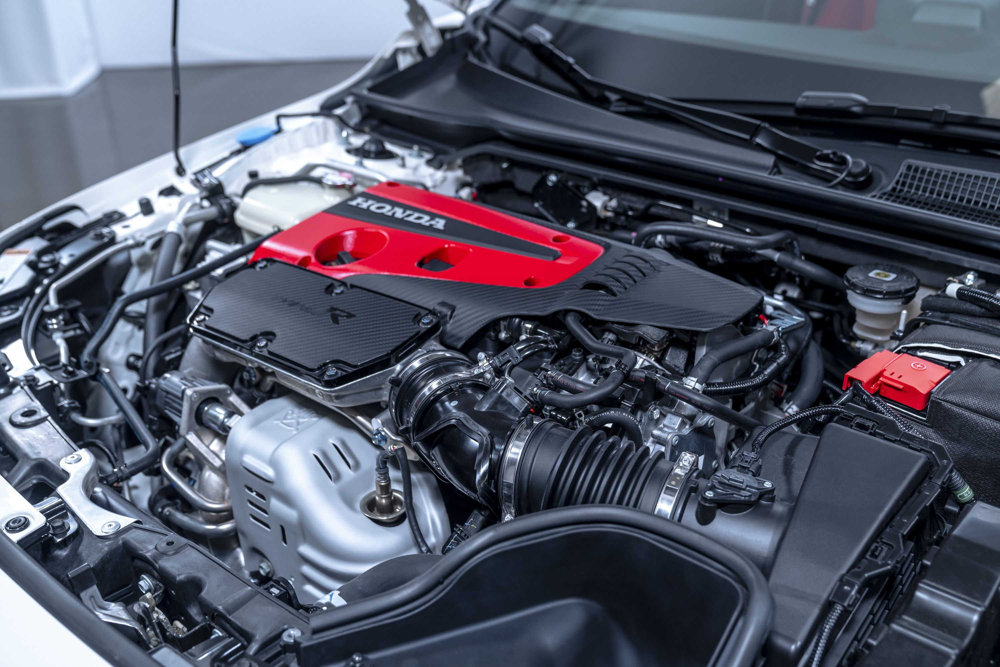
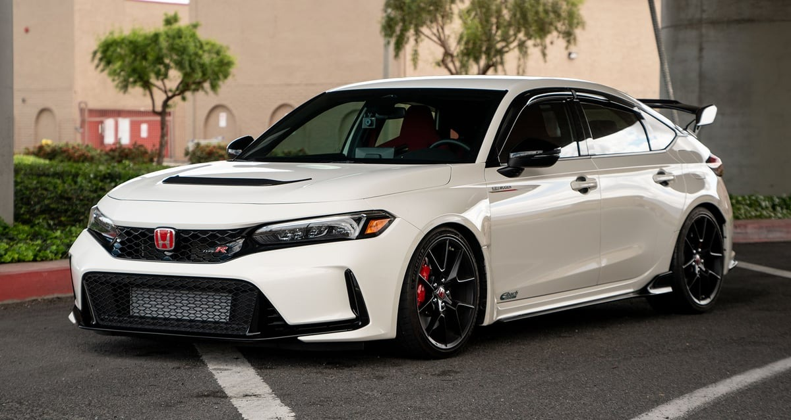
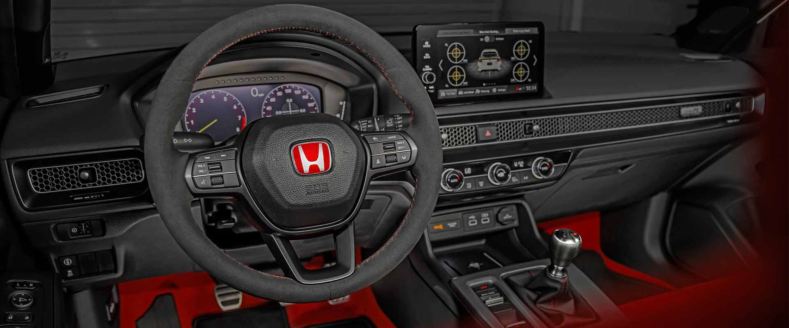

### Introduction

- The Honda Civic Type R is a high-performance version of the iconic Honda Civic, designed for car enthusiasts who seek thrilling driving experiences.

- Known for its dynamic styling and impressive engineering, the Type R offers a blend of speed, agility, and everyday usability.

---

### Engine and Performance

The Honda Civic Type R is powered by:

- A 2.0-liter VTEC turbocharged inline-4 engine, producing up to 315 horsepower and 310 lb-ft of torque.
- A 6-speed manual transmission with rev-match control, ensuring smooth and precise gear shifts.
- A front-wheel-drive layout, coupled with a limited-slip differential for enhanced traction and cornering performance.

With these specifications, the Type R can accelerate from 0 to 60 mph in under 5.5 seconds, with a top speed of approximately 169 mph.

---

### Actual Engine (Honda Civic)

---

### Aerodynamics and Design

The Honda Civic Type R is powered by:

- Aggressive Exterior Styling: Distinctive front fascia with a large air intake, functional hood scoop, and striking rear spoiler.
- Lightweight Materials: Extensive use of aluminum and composite materials to reduce weight and improve handling.
- Aerodynamic Enhancements: Includes vortex generators, underbody panels, and a rear diffuser to optimize airflow and stability.

---

### Actual Design (Honda Civic)

---

### Interior Features

Inside the Honda Civic Type R, you’ll find:

- Red and Black Sport Seats: Designed for maximum comfort and support during spirited driving.
- Digital Instrument Cluster: Displays performance metrics such as lap times, G-forces, and throttle input.
- Premium Materials: Soft-touch surfaces, carbon-fiber accents, and aluminum pedals.
- Infotainment System: Features a 9-inch touchscreen with Apple CarPlay and Android Auto integration, navigation, and premium audio.

---

### Actual Interior (Honda Civic)

---

### Driving Modes

The Civic Type R offers customizable driving experiences with:

- Comfort Mode: Optimizes suspension and steering for everyday use.
- Sport Mode: Enhances throttle response, steering precision, and suspension stiffness for spirited driving.
- +R Mode: Maximizes performance for track conditions by sharpening handling and reducing electronic interventions.

---

### Safety and Technology

The Type R is equipped with advanced safety features, including:

- Honda Sensing® Suite: Adaptive cruise control, lane-keeping assist, and collision mitigation braking.
- Multi-Angle Rearview Camera: Provides better visibility during parking and reversing.
- Blind Spot Monitoring: Alerts drivers to vehicles in adjacent lanes.
- Enhanced Chassis: Features a rigid frame and advanced suspension system for improved safety and stability.

---

### Legacy and Recognition

The Honda Civic Type R has earned:

- Recognition as one of the fastest front-wheel-drive cars at the Nürburgring Nordschleife.
- Multiple awards for its balance of performance, reliability, and affordability.
- A dedicated fan base, celebrating its motorsport heritage and innovative engineering.

---

### Conclusion

The Honda Civic Type R represents the pinnacle of Honda’s performance engineering, combining cutting-edge technology with exhilarating driving dynamics. Whether on the racetrack or city streets, the Type R delivers an unmatched driving experience.

---